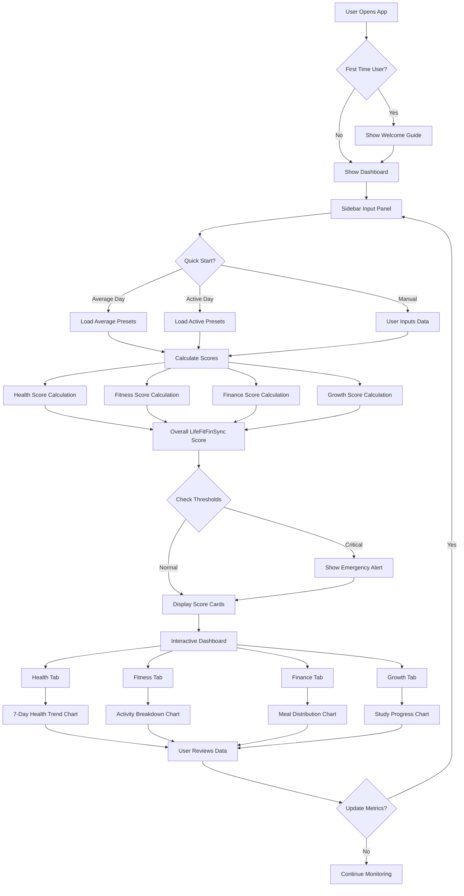
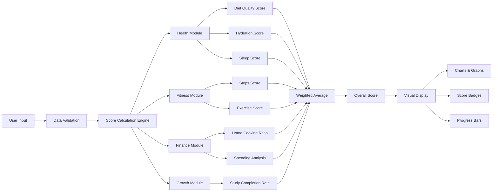
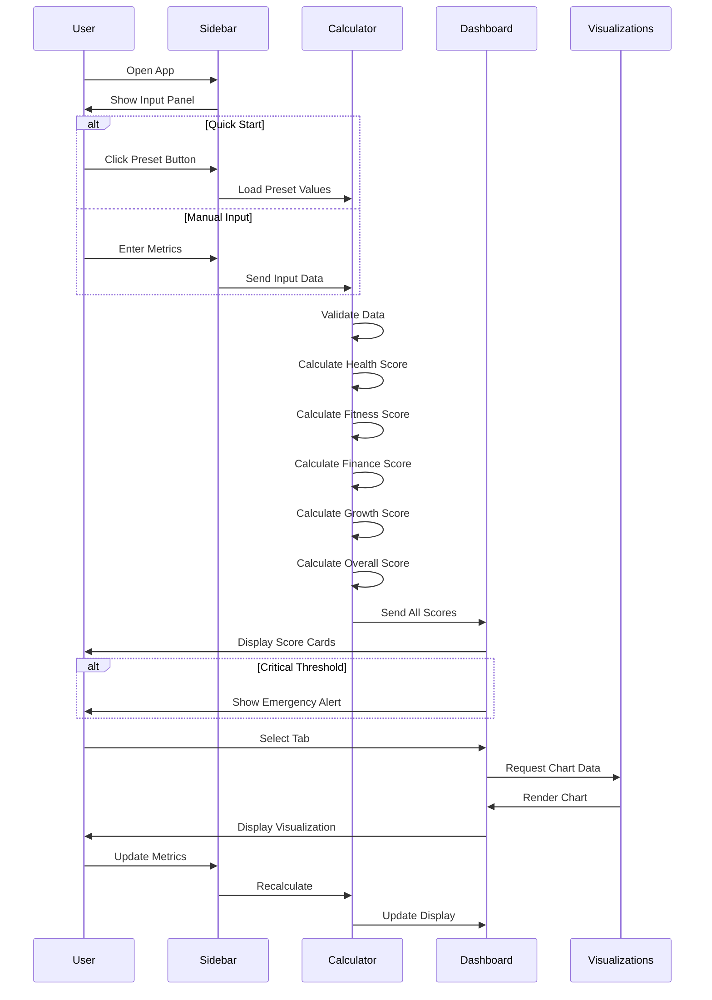
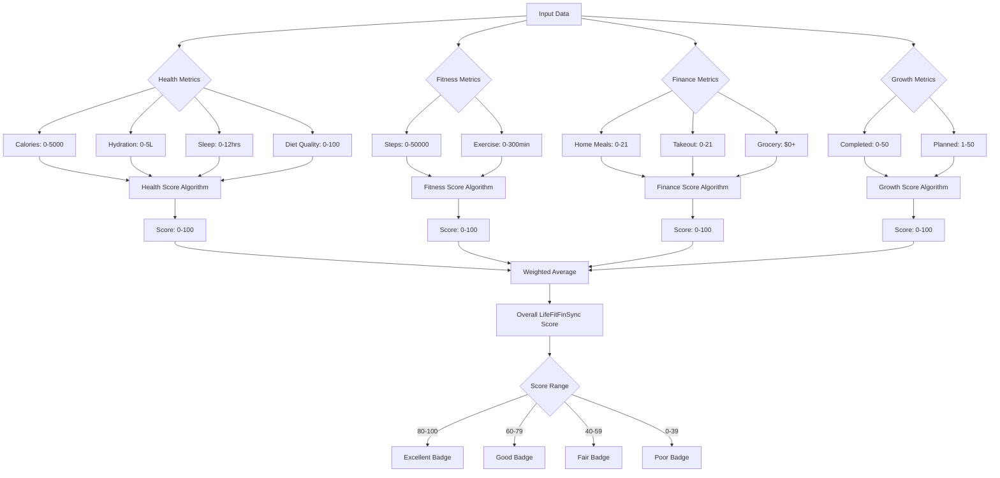
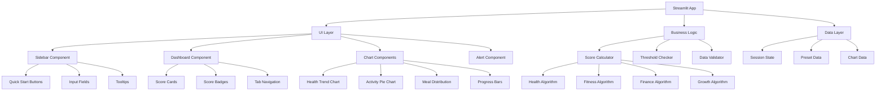
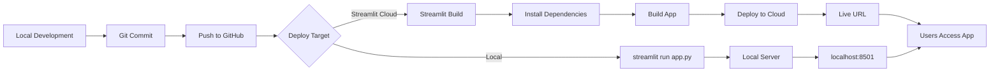
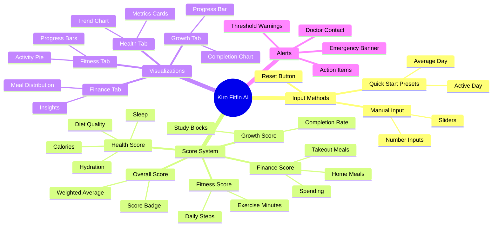

# 🎯 Kiro Fitfin AI - Flow Diagram

## System Architecture Flow

## Data Flow Diagram

## User Interaction Flow

## Score Calculation Flow

## Component Architecture

## Deployment Flow

## Feature Interaction Map

